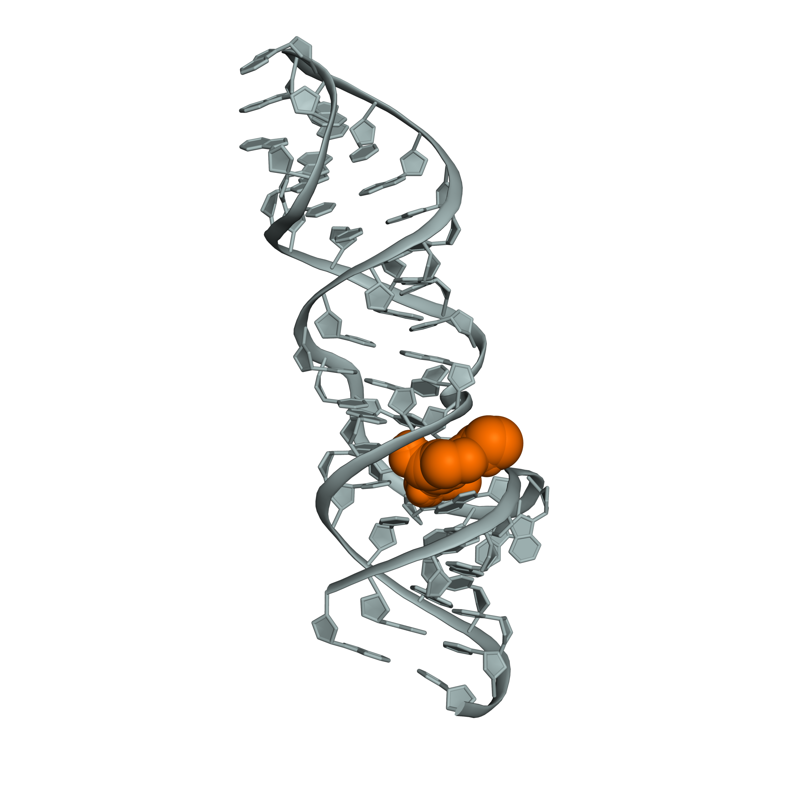
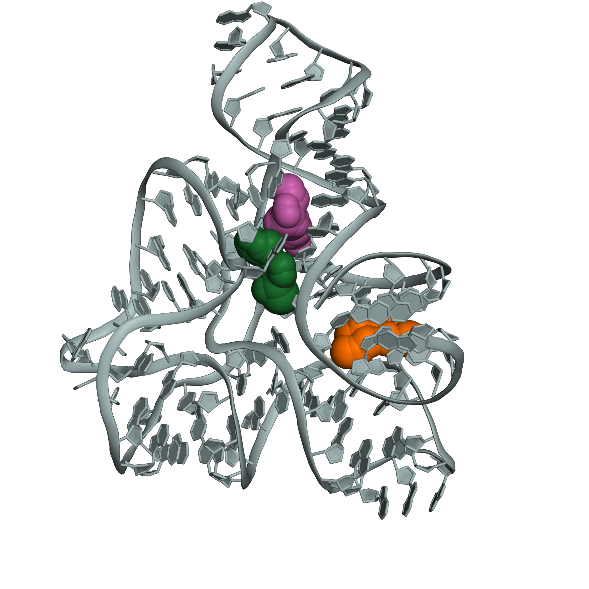
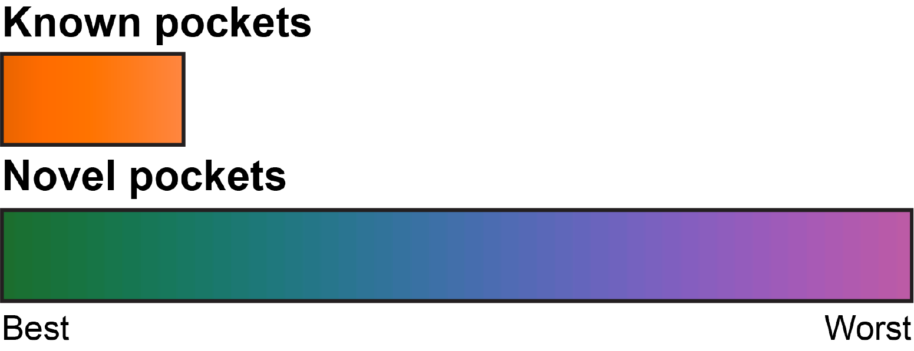
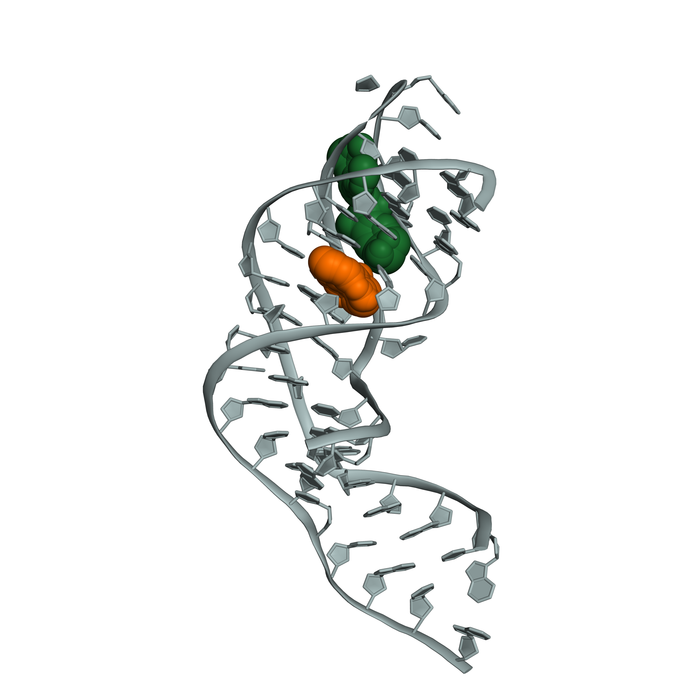
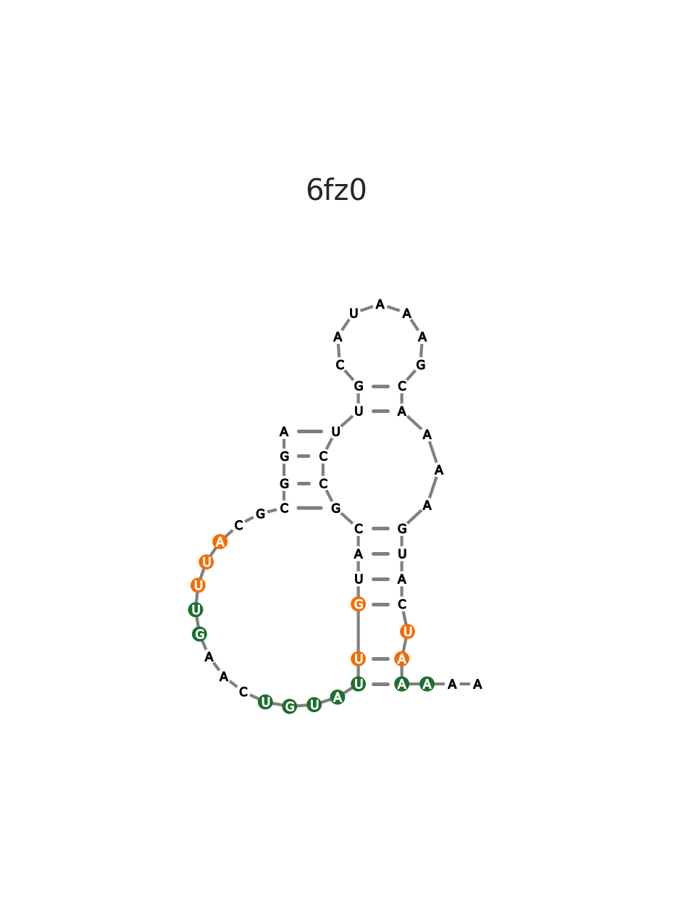

# fpocket Analysis Pipeline Demo

## Before running fpocketR

Activate the fpocketR virtual enviroment and nagivate directories.

    conda activate fpocketR
    cd <path_to_github_repo>/fpocketR/demo

## Manually input RNA structure from a .pdb/.cif file

    python -m fpocketR -pdb 7elr.pdb

    >Detected heteroatoms: ['GTP', 'XAN'].
    >Input the target ligand ID or "None" for no ligand: b XAN

* The user will be prompted to input a ligand ID since the --ligand option was not used.
* Input ligand ID: XAN

<b>Pocket characteristics</b> (.csv)

| PDB  | State | Pocket | Type  | Filter | Score | Drug score | a-sphere | SASA    | Volume  | Hydrophobic density | Apolar a-sphere proportion | Hydrophobicity score | Polarity score | PocketNT                               | Pocket npr1 | Pocket npr2 | Pocket overlap | Ligand overlap | Center criteria | Ligand npr1 | Ligand npr2 | QED score |
| ---- | ----- | ------ | ----- | ------ | ----- | ---------- | -------- | ------- | ------- | ------------------- | -------------------------- | -------------------- | -------------- | -------------------------------------- | ----------- | ----------- | -------------- | -------------- | --------------- | ----------- | ----------- | --------- |
| 7elr |       | 1      | Known | Pass   | 0.34  | 0.28       | 89       | 1.2e+02 | 3.6e+02 | 13                  | 0.16                       | -15                  | 8              | [6, 7, 10, 35, 36, 37, 38, 39, 40, 41] | 0.47        | 0.72        | 0.81           | 1              | 0.89            | 0.36        | 0.64        | 0.45      |

|                                          Pocket in 3D structure (.pse/.pdb)                                           |
| :-------------------------------------------------------------------------------------------------------------------: |
|  |

## Automatically input a structure from a [PDB](https://www.rcsb.org/) code

    python -m fpocketR -pdb 4b5r --ligand SAM

* Requires an internet connection to automatically fetch .pdb/.cif files.

|                                          Pockets in 3D structure (.pse/.pdb)                                          |                                 Pocket legend                                  |
| :-------------------------------------------------------------------------------------------------------------------: | :----------------------------------------------------------------------------: |
|  |  |

## Generate 2D figure of pockets in RNA

    python -m fpocketR -pdb 6fz0.pdb -nsd 6FZ0.nsd --ligand SAM

* 2D figures require the input of an RNA structure drawing from: StructureEditor (.nsd), R2DT, VARNA, XRNA, or FORNA.
* We suggest generating secondary structure files by:
    1) Converting .pdb to .ct files using [rnapdbee](http://rnapdbee.cs.put.poznan.pl)
    2) Making .nsd from .ct files using [StructureEditor](https://rna.urmc.rochester.edu/RNAstructureDownload.html)

|                                          Pocket in 3D structure (.pse/.pdb)                                           |                                        Pocket in 2D Structure (.png/.svg)                                         |
| :-------------------------------------------------------------------------------------------------------------------: | :---------------------------------------------------------------------------------------------------------------: |
|  |  |

## Advanced: run batches of files through fpocket-R using a bash script

    bash fpocketR_batch_submitter.sh

**NOTE: Analyses run from bash scripts must specify ligand name in command line (use the -l or --ligand options).**

### Contents of shell file

> * Specify an nsd file to create 2D figures (-nsd, --nsd).
> * Specify a three character ligand residue name for holo structure analysis (-l, --ligand). 
>
>       -pdb 3e5c.pdb -nsd 3e5c.nsd -l SAM
>
> * Specify the chain id of the RNA, if not chain A (-c, --chain).
>
>       -pdb 2gdi.pdb -nsd 2gdi.nsd -l TPP -c X 
>
> * Specify upto 2 chain ids (eg. A,B) for discontiguous RNAs (-c, --chain).
> * Specify the chain containing the ligand of interest (-l, --ligand).
>
>       -pdb 1ykv.pdb -nsd 1ykv.nsd -l DAI -c A,B -lc A
>
> * Specify *fpocket* parameters to use default parameters (optimized for proteins) or your own parameters (-m, -M, -D, -i, -A, -p).
>
>       -pdb 3e5c.pdb -nsd 3e5c.nsd -l SAM -m 3.4 -M 6.2 -D 2.4 -i 15 -A 3 -p 0
>
> * Specify no ligand for apo structure analysis (-l, --ligand).
> * Analyze multistate structures (-s, --state). (all states = 0)
>
>       -pdb 6MCI.pdb -nsd 6MCI.nsd -l no -s 0 -al
>
> * Specify the resolution for 3D figures to decrease render time or increase quality (-dpi, --dpi).
> * Specify a custom name for the output directory (-o, --out).
>
>       -pdb 7EZ0.pdb -nsd 7EZ0.nsd -l no -c N -dpi 50 -o group_I_intron
>

## fpocket-R options

| Input options                 | Description                                                                                  |
| :---------------------------- | :------------------------------------------------------------------------------------------- |
| -pdb, --pdb STRING (Required) | Path to a .pdb file, .cif file, or 4 charater PDB indentification code.                      |
| -ss, --ss STRING              | Path to an .ss or other secondary structure file for generating secondary structure figures. |

| fpocket parameter options | Description                                                                                   |
| :------------------------ | :-------------------------------------------------------------------------------------------- |
| -m, --m FLOAT             | fpocket -m argument. Specifies the minimum radius for an a-sphere (3.0).                      |
| -M, --M FLOAT             | fpocket -M argument. Specifies the maximium radius for an a-sphere (5.70).                    |
| -i, --i INT               | fpocket -i argument. Specifies the minimum number of a-spheres per pocket (42).               |
| -D, --D FLOAT             | fpocket -D argument. Specifies the a-sphere clustering distance for forming pockets (1.65).   |
| -A, --A INT               | fpocket -A argument. Number of electronegative atoms required to define a polar a-sphere (3). |
| -p, --p FLOAT             | fpocket -p argument. Maximum ratio of apolar a-spheres in a pocket (0.0).                     |

| Output options    | Description                                                                                         |
| :---------------- | :-------------------------------------------------------------------------------------------------- |
| -o, --out STRING  | Specify name of fpocket output parent directory name. (Default: fpocket-R_out_{fpocket parameters}) |
| -n, --name STRING | Specify name prefix for fpocket_out and analysis_out subdirectories. (Default: None)                |
| -y, --yes BOOLEAN | Overwrites output files and directories with same name. (Default: False)                            |

| Analysis settings          | Description                                                                                                                                                                     |
| :------------------------- | :------------------------------------------------------------------------------------------------------------------------------------------------------------------------------ |
| -s, --state INT            | Specify the NMR states/model you would like to analyze. 0 for all (None).                                                                                                       |
| -c, --chain STING          | Specify the chain(s) IDs containing RNA (case sensitive). List up to 2 chains separated by a comma (eg. A,B). (Default: first detected chain)                                   |
| -l, --ligand STRING        | PDB ligand identification code (≤ 3 characters).                                                                                                                                |
| -lc, --ligandchain STRING  | Chain containing ligand the from the input .pdb file (--chain input).                                                                                                           |
| -off, -offset INT          | Specify an offset between the starting nucleotide of the rna sequence and starting nucleotide of the PDB structure. offset = starting index of the PDB sequence - 1 (automatic) |
| -qf, --qualityfilter FLOAT | Specify minimum fpocket score for pocket (0.0).                                                                                                                                 |

| Figure settings              | Description                                                       |
| :--------------------------- | :---------------------------------------------------------------- |
| -dpi, --dpi INT              | Sets figure resolution in dpi (300).                              |
| -zoom, --zoom INT            | Zoom buffer (Å) for creating 3D figures (5.0).                    |
| -cp, --connectpocket BOOLEAN | Visually connects pockets in 2D figures (False).                  |
| -al, --alignligand BOOLEAN   | Aligned RNA structure to output .pse file (Default: <input pdb>). |
