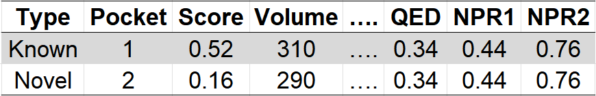
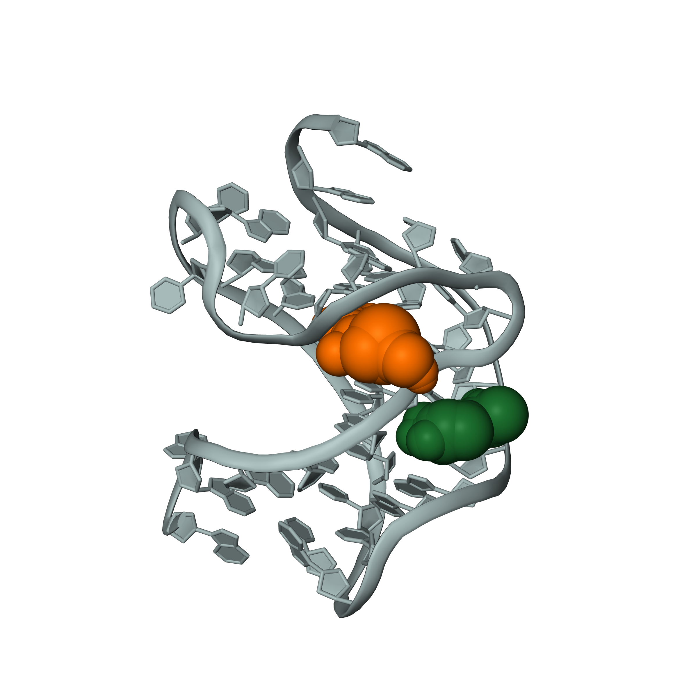
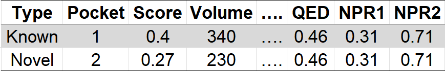

# fpocketR

[//]: # (Badges)
[](https://github.com/weeks-UNC/fpocketR/actions?query=workflow%3ACI)
[](https://pypi.org/project/fpocketR/)
[](https://anaconda.org/bioconda/fpocketr)
[](https://pepy.tech/project/fpocketR)


A CLI tool optimized to find, characterize, and visualize drug-like RNA-ligand binding pockets in RNA structures (static or dynamic).

fpocketR is an RNA-specific wrapper for [fpocket 4.0](https://github.com/Discngine/fpocket)

[**Documentation**: fpocketR ReadTheDocs](https://fpocketr.readthedocs.io/en/latest/)

## Contents

- [System Requirements](#system-requirements)
-- [Installation](#installation)
   - [Recommended: Bioconda](#recommended-bioconda)
   - [Alternative: Conda + pip](#alternative-conda--pip)
   - [Testing your installation](#testing-your-installation)
- [Quick Start](#quick-start)
   - [Activate the fpocketR Environment](#activate-the-fpocketr-environment)
   - [Basic Structure Analysis](#basic-structure-analysis)
   - [Secondary Structure Visualization](#secondary-structure-visualization)
   - [Multistate Analysis](#multistate-analysis)
   - [Apo/Holo Analysis](#apoholo-analysis)
   - [Additional Arguments](#additional-arguments)
- [Demonstration Workflows](#demonstration-workflows)
- [Usage](#usage)
- [Copyright](#copyright)
- [Acknowledgements](#acknowledgements)

## System Requirements

- **Supported platforms:** Linux (x86_64), MacOS (Intel/x86_64)
- **Not supported:** ARM-based MacOS (M1/M2) and native Windows
- **Experimental:** fpocketR may work on ARM MacOS with fpocket 4.2.1+. **WARNING:** We had observed that newer version of fpocket (>4.0.3) led to changes in predicted pockets which we have not validated.
- **Windows users:** Use [WSL2 (Windows Subsystem for Linux)](https://learn.microsoft.com/en-us/windows/wsl/install) to run fpocketR. Follow the install instructions using the WSL2 linux terminal.


## Installation

### Recommended: Bioconda

`fpocketR` is now available on [Bioconda](https://bioconda.github.io/recipes/fpocketr/README.html)!

1. **Install Conda**  
   If you don’t have conda, follow the [official installation guide](https://conda.io/projects/conda/en/latest/user-guide/install/index.html).

2. **Add the Bioconda channel (if not already added):**
   ```bash
   conda config --add channels defaults
   conda config --add channels bioconda
   conda config --add channels conda-forge
   ```

3. **Create and activate a new environment with fpocketR:**
   ```bash
   conda create -n fpocketR fpocketr
   conda activate fpocketR
   ```
   This will install all required dependencies, including `fpocket` and `fpocketR`.

---

### Alternative: Conda + pip

If you prefer to install via PyPI, you can use Conda to set up the environment and then install `fpocketR` with pip:

1. **Create and activate a new environment with fpocket and Python 3.11**  
   ```bash
   conda create -n fpocketR -c conda-forge fpocket=4.0.3 python=3.11 pymol-open-source=2.5
   conda activate fpocketR
   ```

2. **Install fpocketR and dependencies from PyPI**  
   ```bash
   pip install fpocketr
   ```
   **Note:** The `fpocket` binary is installed via conda, not pip.


### Testing your installation

After installing, you can verify your setup by running the test suite:

1. Make sure you have installed the testing tools:
   ```bash
   pip install 'fpocketR[test]'
   ```

2. Find the fpocketR install location:
   ```bash
   python -c "import fpocketR; print(fpocketR.__file__)"
   ```

3. Run `pytest` in the fpocketR source directory:
   ```bash
   pytest /path/to/fpocketR/
   # or, if you are in the source directory:
   pytest
   ```

If all tests pass, your installation is working correctly.

**Notes:**
- For Windows users, use WSL (Windows Subsystem for Linux) for best compatibility. [Guide to installing WSL and Ubuntu](https://www.freecodecamp.org/news/how-to-install-wsl2-windows-subsystem-for-linux-2-on-windows-10/)
- For MacOS users: fpocketR is not compatible with arm-based M1/M2 processors (only Intel/x86).

## Quick Start

Run fpocketR from the command line to analyze RNA structures and visualize ligand binding pockets.

### Activate the fpocketR Environment

Activate your environment after installing fpocketR and its dependencies:

```bash
conda activate fpocketR
```

**Tip:** For a full list of options, run:

```bash
python -m fpocketR --help
```

### Basic Structure Analysis

Analyze a local PDB file or fetch by PDB ID using the `-pdb` argument:

```bash
python -m fpocketR -pdb 3e5c.pdb
# or
python -m fpocketR -pdb 3e5c
```

**Example output:**

| Tertiary structure | Pocket characteristics |
| :----------------: | :-------------------: |
|  |  |

**Pocket color legend:**


### Secondary Structure Visualization

Add a secondary structure diagram using the `-ss` argument:

```bash
python -m fpocketR -pdb 2l1v.pdb -ss 2l1v.nsd
```

**Example output:**

| Tertiary structure | Secondary structure | Pocket characteristics |
| :----------------: | :-----------------: | :-------------------: |
|  |  |  |

### Multistate Analysis

Analyze all NMR or Cryo-EM states using the `--state 0` argument:

```bash
python -m fpocketR -pdb 2l1v.pdb -ss 2l1v.nsd --state 0
```

**Example output:**

| Tertiary structure<br>(pocket density) | Secondary structure<br>(pocket density) | Pocket summary<br>(all states) |
| :-----------------------------: | :----------------------------------: | :-------------------------: |
|  |  |  |

### Apo/Holo Analysis

Align ligand-bound (holo) and ligand-free (apo) structures for direct comparison using the `--alignligand` argument:

```bash
python -m fpocketR -pdb 8f4o_apo.pdb --alignligand 2gdi_holo.pdb --knownnt 19,20,42,43
```

**Example output:**

| Apo structure and pocket | Apo and holo structures aligned |
| :----------------------: | :-----------------------------: |
|  |  |

### Additional Arguments

Customize analysis with optional arguments:

- Select RNA chain: `-c (--chain)`
- Select ligand: `-l (--ligand)`
- Set raytracing resolution (lower = faster): `-dpi (--dpi)`
- Specify output path: `-o (--out)`

```bash
python -m fpocketR -pdb 2gdi_holo.pdb --chain Y --ligand TPP --dpi 10 --out ./TPP_RS
```

**Example output:**

* Output files and figures add to custom directory: `./TPP_RS/2gdi_holo_clean_out/`.

| Tertiary structure (low resolution) |
| :----------------------------------: |
|  |

## Demonstration Workflows

For advanced usage and batch processing, see the example workflows in the `/fpocketR/demo` folder:

- [Batch submission using Bash scripts](./demo/batch_submission_bash/README.md)
- [Batch submission using Snakemake](./demo/batch_submission_snakemake/README.md)
- [Multistate analysis on modeled RNA structures from CASP](./demo/modeled_RNA/README.md)

Each demo includes step-by-step instructions and sample files to help you automate fpocketR analyses for large datasets or complex workflows.

## Usage

Full list of arguments for fpocketR.

| Option / Argument             | Type        | Description                                                                                                                                                                                                                                                           |
| :---------------------------- | :---------- | :-------------------------------------------------------------------------------------------------------------------------------------------------------------------------------------------------------------------------------------------------------------------- |
| **Input options**             |             |                                                                                                                                                                                                                                                                       |
| `-pdb`, `--pdb` (Required)    | str         | Path to a .pdb file, .cif file, or 4 character PDB identification code.                                                                                                                                                                                               |
| `-ss`, `--ss`                 | str         | Path to an .ss or other secondary structure file for generating secondary structure figures.                                                                                                                                                                          |
| **fpocket parameter options** |             |                                                                                                                                                                                                                                                                       |
| `-m`                          | float       | Minimum radius for an a-sphere (Default: 3.0).                                                                                                                                                                                                                        |
| `-M`                          | float       | Maximum radius for an a-sphere (Default: 5.70).                                                                                                                                                                                                                       |
| `-i`                          | int         | Minimum number of a-spheres per pocket (Default: 42).                                                                                                                                                                                                                 |
| `-D`                          | float       | A-sphere clustering distance for forming pockets (Default: 1.65).                                                                                                                                                                                                     |
| `-A`                          | int         | Number of electronegative atoms required to define a polar a-sphere (Default: 3).                                                                                                                                                                                     |
| `-p`                          | float       | Maximum ratio of apolar a-spheres in a pocket (Default: 0.0).                                                                                                                                                                                                         |
| **Output options**            |             |                                                                                                                                                                                                                                                                       |
| `-o`, `--out`                 | str         | Path to the output parent directory (Default: "./fpocketR_out").                                                                                                                                                                                                      |
| `-n`, `--name`                | str         | Output filename prefix and output subdirectory name (Default: "{PDB}_clean_out").                                                                                                                                                                                     |
| `-y`, `--yes`                 | bool        | Answers yes to user prompts for overwriting files (Default: False).                                                                                                                                                                                                   |
| **Analysis settings**         |             |                                                                                                                                                                                                                                                                       |
| `-s`, `--state`               | int         | Specify the NMR states/model to analyze. 0 for all (Default: None).                                                                                                                                                                                                   |
| `-c`, `--chain`               | str         | Specify a chain from the input .pdb file (Default: <first_rna_chain>).                                                                                                                                                                                                |
| `-l`, `--ligand`              | str         | PDB ligand identification code (2-3 characters).                                                                                                                                                                                                                      |
| `-lc`, `--ligandchain`        | str         | Chain containing ligand from the input .pdb file (Default: <--chain input>).                                                                                                                                                                                          |
| `-nt`, `--knownnt`            | list[int]   | List residue IDs of nucleotides in known pocket (e.g. 1,2,3) (Default: None).                                                                                                                                                                                         |
| `-off`, `--offset`            | int         | Offset between starting nucleotide of RNA sequence and starting nucleotide of PDB structure (automatic).                                                                                                                                                              |
| `-qf`, `--qualityfilter`      | float       | Minimum fpocket score for pocket (Default: 0.0).                                                                                                                                                                                                                      |
| **Figure settings**           |             |                                                                                                                                                                                                                                                                       |
| `-dpi`, `--dpi`               | int         | Figure resolution in dpi (Default: 300).                                                                                                                                                                                                                              |
| `-z`, `--zoom`                | float       | Zoom buffer (Å) for creating 3D figures (Default: 5.0).                                                                                                                                                                                                               |
| `-cp`, `--connectpocket`      | bool        | Visually connects pockets in 2D figures (Default: False).                                                                                                                                                                                                             |
| `-al`, `--alignligand`        | str \| bool | Align structure with pocket prediction (target structure) to an RNA structure with a ligand (mobile structure).<br> &nbsp; If `str`: path to a .pdb file, .cif file, or 4 character PDB identification of the mobile structure.<br> &nbsp; If `bool`: input PDB file is used as the mobile structure.|
|                               |             |                                                                                                                                                                                                                                                                       |


### TIP: To see all these options in your terminal, run:

```bash
python -m fpocketR --help
```

## How to Cite fpocketR

If you use fpocketR in your research, please cite:

1. S.D. Veenbaas, J.T. Koehn, P.S. Irving, N.N. Lama, & K.M. Weeks, Ligand-binding pockets in RNA and where to find them, Proc. Natl. Acad. Sci. U.S.A. 122 (17) e2422346122, https://doi.org/10.1073/pnas.2422346122 (2025).

2. Veenbaas, S. D., Felder, S., & Weeks, K. M. fpocketR: A platform for identification and analysis of ligand-binding pockets in RNA. BioRxiv, 2025.03.25.645323, https://doi.org/10.1101/2025.03.25.645323 (2025).

## Copyright

Copyright (c) 2025, Seth Veenbaas


## Acknowledgements

Special thanks to [psirving](https://github.com/Psirving) for helpful feedback and contributions.

Project based on the 
[Computational Molecular Science Python Cookiecutter](https://github.com/molssi/cookiecutter-cms) version 1.11.
