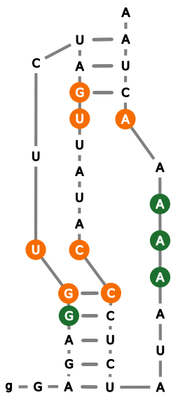
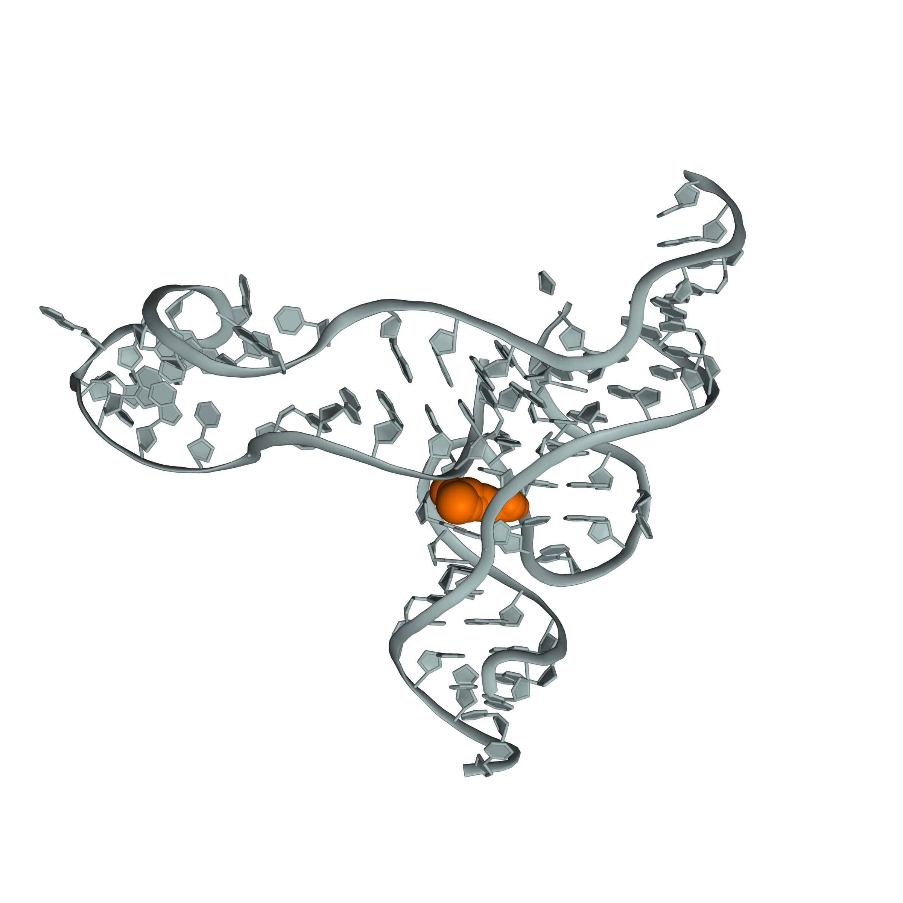

# Quickstart Guide

Run fpocketR from the command line to analyze RNA structures and visualize ligand binding pockets.

## Activate the fpocketR Environment

```bash
conda activate fpocketR
```

**Tip:** For a full list of options, run:

```bash
python -m fpocketR --help
```

## Basic Structure Analysis

Analyze a local PDB file or fetch by PDB ID using the `-pdb` argument:

```bash
python -m fpocketR -pdb 3e5c.pdb
# or
python -m fpocketR -pdb 3e5c
```

**Example output:**

| Tertiary structure | Pocket characteristics |
| :----------------: | :-------------------: |
|  |  |

**Pocket color legend:**


## Secondary Structure Visualization

Add a secondary structure diagram using the `-ss` argument:

```bash
python -m fpocketR -pdb 2l1v.pdb -ss 2l1v.nsd
```

| Tertiary structure | Secondary structure | Pocket characteristics |
| :----------------: | :-----------------: | :-------------------: |
|  |  |  |

## Multistate Analysis

Analyze all NMR or Cryo-EM states using the `--state 0` argument:

```bash
python -m fpocketR -pdb 2l1v.pdb -ss 2l1v.nsd --state 0
```

| Tertiary structure (pocket density) | Secondary structure (pocket density) | Pocket summary (all states) |
| :-----------------------------: | :----------------------------------: | :-------------------------: |
|  |  |  |

## Apo/Holo Analysis

Align ligand-bound (holo) and ligand-free (apo) structures for direct comparison using the `--alignligand` argument:

```bash
python -m fpocketR -pdb 8f4o_apo.pdb --alignligand 2gdi_holo.pdb --knownnt 19,20,42,43
```

| Apo structure and pocket | Apo and holo structures aligned |
| :----------------------: | :-----------------------------: |
|  |  |

## Additional Arguments

Customize analysis with optional arguments:

- Select RNA chain: `-c (--chain)`
- Select ligand: `-l (--ligand)`
- Set raytracing resolution (lower = faster): `-dpi (--dpi)`
- Specify output path: `-o (--out)`

```bash
python -m fpocketR -pdb 2gdi_holo.pdb --chain Y --ligand TPP --dpi 10 --out ./TPP_RS
```

* Output files and figures add to custom directory: `./TPP_RS/2gdi_holo_clean_out/`.

| Tertiary structure (low resolution) |
| :----------------------------------: |
|  |
